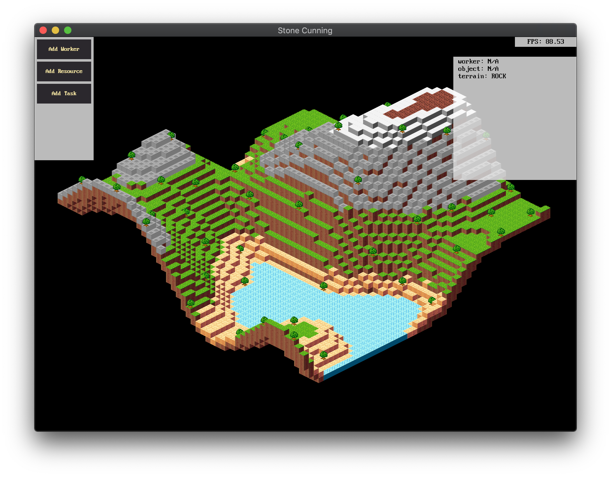

# stone cunning

`stone-cunning` is a Dwarf Fortress inspired town builder.

The origin of the name "[stonecunning](https://roll20.net/compendium/dnd5e/Dwarf#content)" comes from D&D dwarven ability to check the origin of stonework.

## Media

## Building & Running

You can run the current version of `stone-cunning` by running the following
command in the project root directory:

    > cargo run --release

## Development

Stone cunning is divided up using [Cargo workspaces][cargo-workspaces], with
the idea that each individual library can be tested and run by itself without the need to run the entire game.

[cargo-workspaces]: https://doc.rust-lang.org/book/ch14-03-cargo-workspaces.html

Libraries can depend on each other and often refer to each other, e.g. `libpath`
will need to refer to types in `libterrain` to make sure a path is unencumbered.

### libdwarf

The core of `stone-cunning`, used to simulate the dwarfs and (eventually) monsters.

### libterrain

Library used to generate terrain and eventually handle chunking, saving/loading
maps, etc.

## Roadmap (TODOs)

### Core Mechanics
- [] Pathing
- [] Resource gathering
- [] Mining
- [] Buildings
- [] Task management

### Resources
- [] Tree variety
- [] Stone variety
- [] Farming support

### Terrain
- [] Move biomes into config file(?)
- [] More Biome types.
- [] Support for multiple chunks.

### NPCs
- [] Support for monsters.

## Credits

* Font: *IBM VGA8* part of the [The Ultimate Oldschool PC Font Pack](https://int10h.org/oldschool-pc-fonts/). License: [CC BY-SA 4.0](http://creativecommons.org/licenses/by-sa/4.0/)